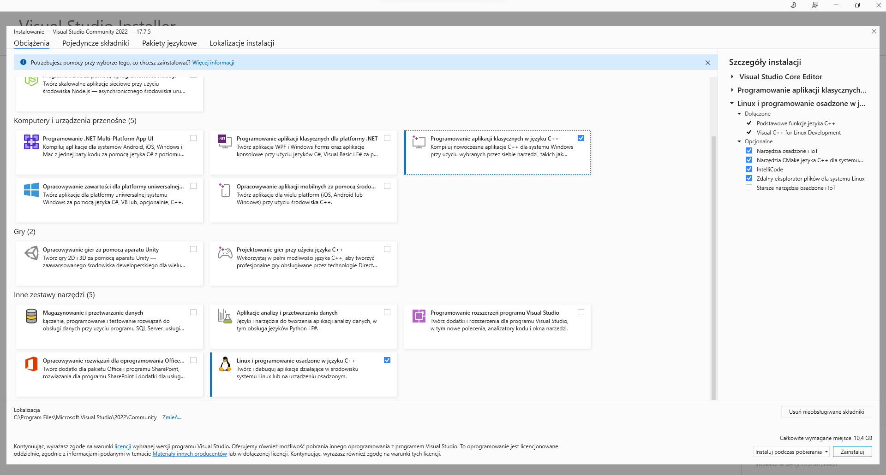

# Środowiska programistyczne

[Visual studio](https://visualstudio.microsoft.com/pl/students/)

[Visual Studio Code](https://code.visualstudio.com/Download)

[CLion](https://www.jetbrains.com/community/education/#students)



## Visual studio potrzebne składniki



## Visual Studio Code i CLion

Visual Studio Code i CLion to są jedynie środowiska programistyczne, wymagają one instalacji kompilatora. Może to być kompilator Visual Studio (bez IDE), MinGw, czy też Ubuntu pod WSL.